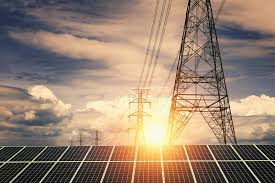
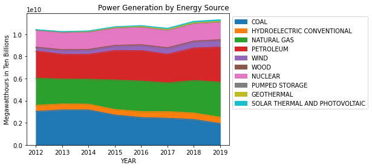
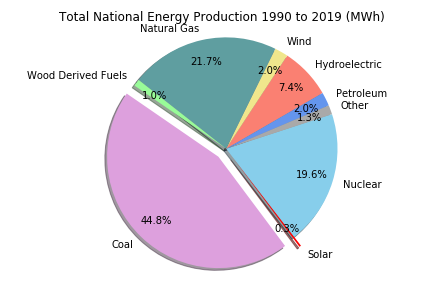
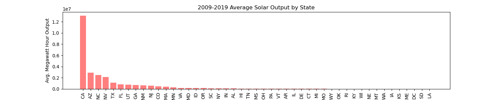
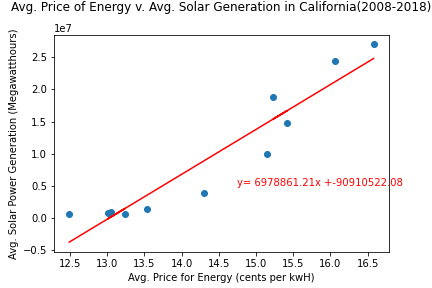

# Solar_Power-Usage
Project 1 for UCSD Data Science Bootcamp.

Here, we're looking at solar power usage across the US, identifying areas or highest usage, under-utilization and potential growth

## Project Objective

Hypothesis:
- The US is massively underutilizing solar power.

Core Question:
- What does US solar power production look like?

Further Quesitions:
- Is solar power as big of a trend in other states as it is in California? Do we love it because our energy is expensive?
- Are we underutilizing solar power?
- How much energy does the US use and how much of that is solar?
- Are states increasing solar production at a steady rate across the board or are some states doing better than others?

Why ask these questions?
- Importance of renewable energy
- Impact on our daily lives

## Main Findings

- Solar power is one of the least utilized energy sources in the US

- Coal makes up almost half of all energy production (1990-2019)

- California produces A LOT of solar power

- Energy prices in California are definitely increasing, as is solar power

- Other very sunny states are not producing at the same rate as California

## Questions and Data

- How much energy is created by solar compared to other energy sources?
- What states could show potential for solar energy production?
    - Needed to understand potential sunshine hours for states and cities across the US
    
.png)

- How much solar power is the US producing by state ? 
    - Last year
    - The past decade
- Does cost of energy affect a state’s likelihood to produce more solar power?
